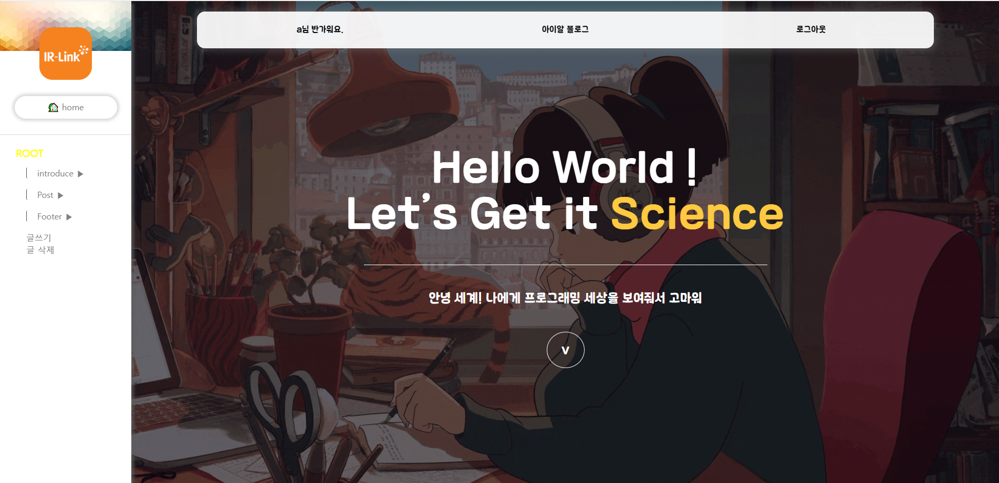
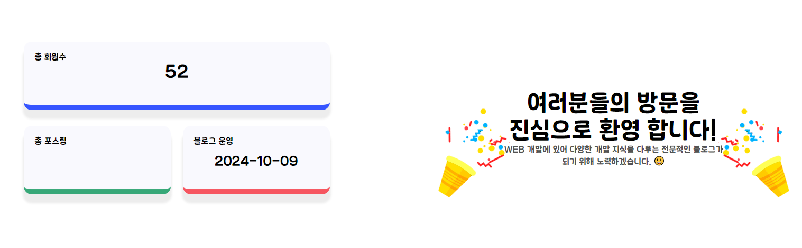
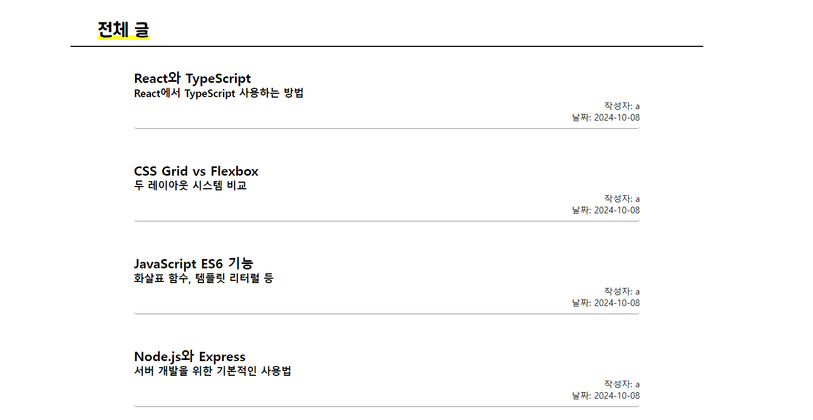
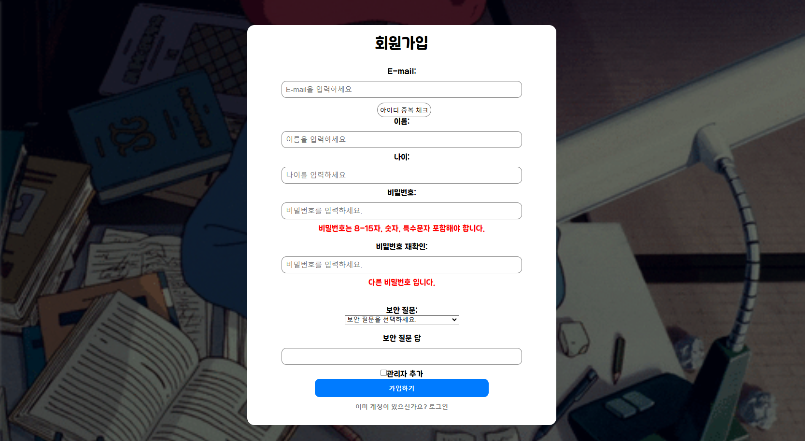
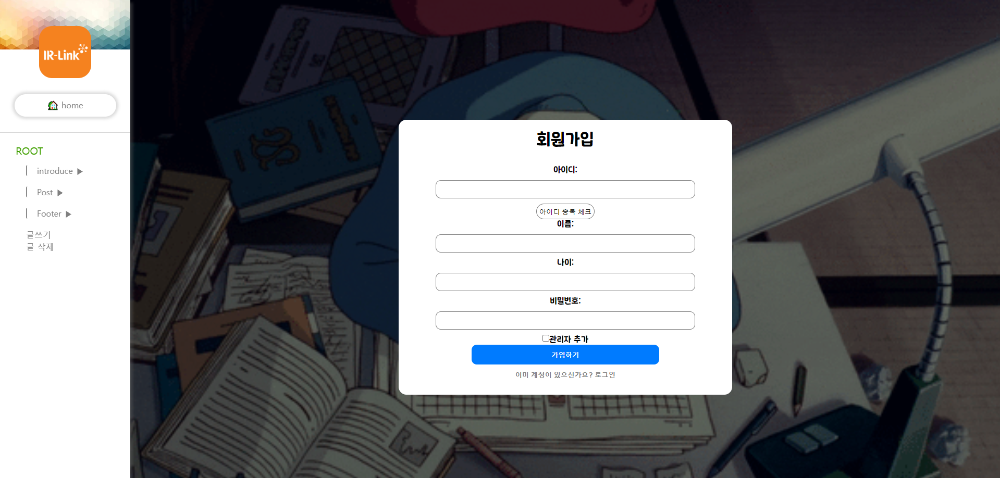
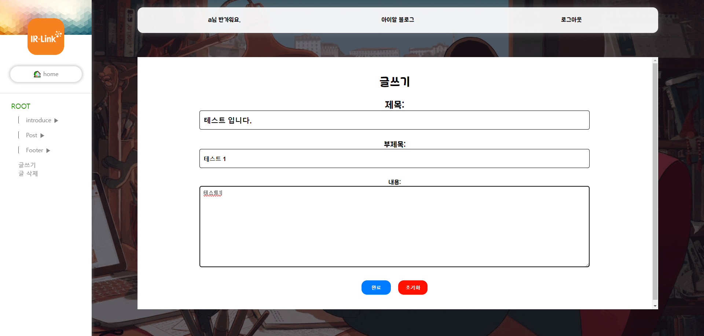

# Study-Blog

### 프로젝트 소개

---

- 플랫폼: Web / 웹
- 제작인원: 3 인 ( 팀 구성: Frontend 1명, Backend 2명 )
- 제작 기간: 30 일 (2024.10.01 ~ 2024.31.)
- 사용 기술: React, Express

'Study-Blog'는 공부에 대한 지식을 필요로 하는 사람들의 대한 웹입니다.
기존에 공부자료가 흩어져 있어 찾기 불편했다면 접근성이 용이한 웹으로 언제 어디서든 접속하여 필요한 공부자료를 찾아볼 수 있습니다.

### 미리보기

메인화면

admin 데이터 화면

전체 글 목록 화면

로그인 페이지

회원가입 페이지

글쓰기 페이지

### 구현기능

---

- 회원가입 / 로그인 ( 아이디 중복 체크 ) 기능
- 글 보기 기능
- 글 쓰기 기능
- 글 삭제 기능
- admin이 가입한 날짜표기 기능
- 회원 수 보기 기능
- react-paginate 페이지네이션 구현하기

### 배운 것

react
