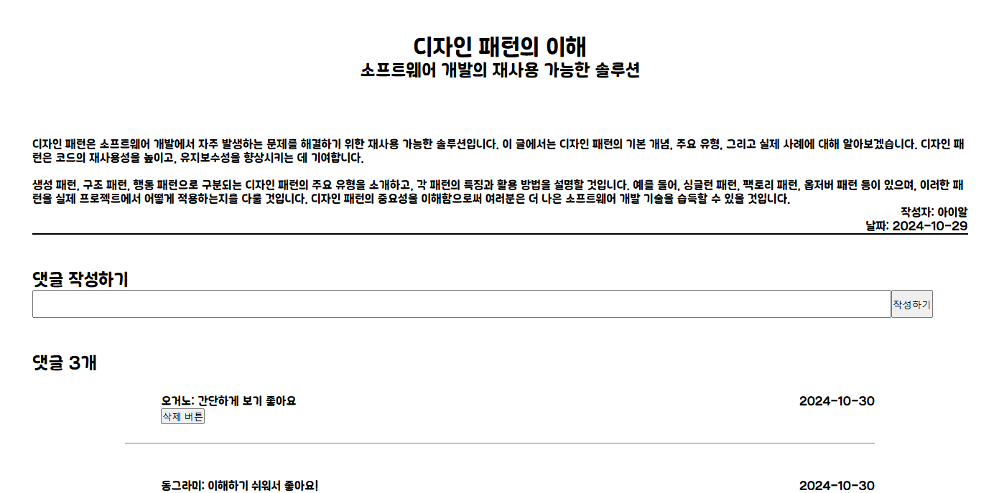
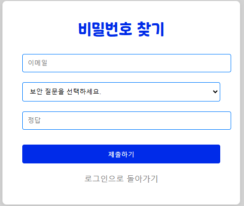

# Study-Blog

### 프로젝트 소개

---

- 플랫폼: Web / 웹
- 제작인원: 3 인 ( 팀 구성: Frontend 1명, Backend 2명 )
- 제작 기간: 30 일 (2024.10.01 ~ 2024.31.)
- 사용 기술: React, Express

'Study-Blog'는 공부에 대한 지식을 필요로 하는 사람들의 대한 웹입니다.
기존에 공부자료가 흩어져 있어 찾기 불편했다면 접근성이 용이한 웹으로 언제 어디서든 접속하여 필요한 공부자료를 찾아볼 수 있습니다.

### 미리보기

메인화면

admin 데이터 화면

전체 글 목록 화면

로그인 페이지

회원가입 페이지

글쓰기 페이지

### 구현기능

---

- 회원가입
  - 아이디 중복체크
  - 관리자 추가
- 로그인
  - 관리자로 로그인
- 메인
  - 총회원 수 보기
  - 총 포스팅 수 보기
  - 블로그 운영날짜 보기
- 전체글 보기
  - 자세히 보기
- 글 쓰기 기능
- 글 삭제 기능
- 페이지네이션 구현

---

### 배운 것

React의 pagination 라이브러리(react-paginate)을 사용하여 페이지네이션을 구현하였다.
API의 DELECT 메소드를 사용하여 데이터 삭제 기능을 구현하였다.
React의 CSS 라이브러리(Styled-Components)를 사용하여 디자인해보고 사용이유를 깨닳았다.

- 사용이유
  - CSS 파일을 갯수를 최소화 할 수 있음.
  - ClassName 중복등으로 인한 버그를 생기지 않도록 할 수 있음.
  - 다른 styled-component 스타일을 상속 받아서 코드의 재사용성을 높일 수 있음.
  - style component는 화면에 컴포넌트가 렌더링 되었는지 추적해 컴포넌트에 대한 스타일을 자동 삽입한다. 코드를 적절히 분배해 놓으면 최소한의 코드만으로 화면이 띄워질 수 있음.
    - 단점
      - JS 파일이 매우 복잡해짐
      - JS 파일 간 중복 디자인이 많이 필요한 경우

---

### 아쉬운 점

디렉토리 관리와 컴포넌트 분리가 잘 이루어지지 않았다..

React 컴포넌트를 분리하는 기준

1. 재사용성
   - 다른 부분에서도 사용될 수 있는지 여부
2. 단일 책임 원칙
   - 각 컴포넌트는 하나의 기능만 수행
3. 가독성
   - 너무 많은 JSX, 로직 포함 → 더 작은 단위로 분리
4. 상태와 라이프사이클
   - 컴포넌트의 성능과 동작에 미치는 영향을 고려하여 분리
5. UI 요소
   - 서로 다른 시각적 요소는 컴포넌트로 분리
     컴포넌트 분리의 중요성
6. 유지보수성
7. 확장성
8. 재사용성
